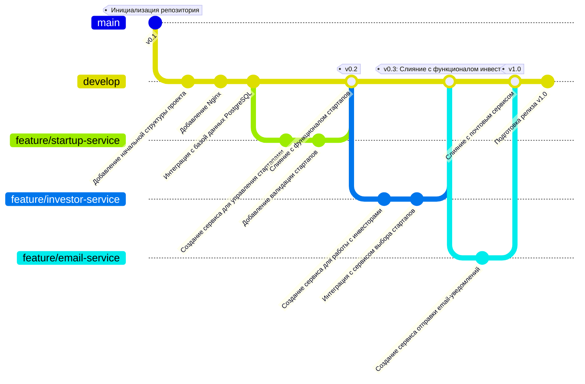
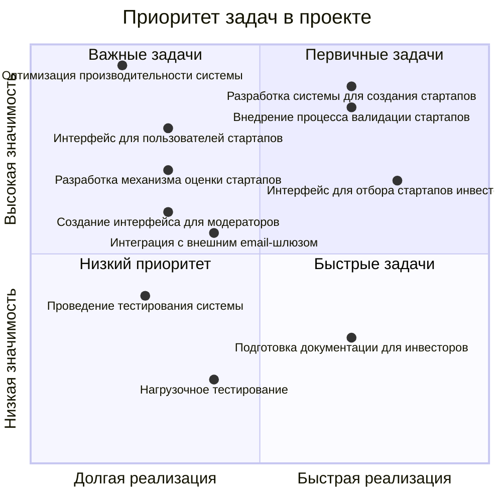
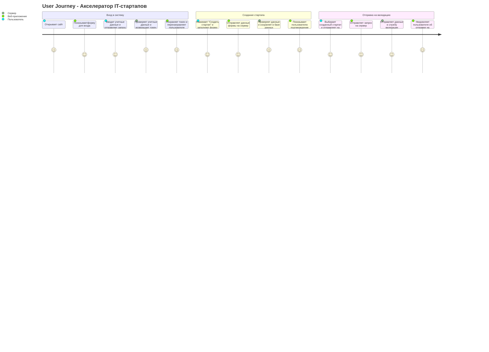
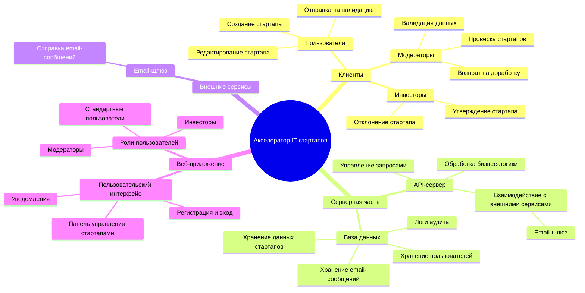

# PKSS-12

### Пояснение диаграммы

### Инициализация репозитория

        Коммит: v0.1
        Описание: Инициализация репозитория и подготовка основного окружения для проекта.
        Основная ветка разработки: develop

### Добавление начальной структуры проекта

        Коммит: Добавление начальной структуры проекта
        Описание: Создание начальной структуры проекта, включающей базовую настройку каталогов и файлов.

### Добавление сервера Nginx

        Коммит: Добавление сервера веб-приложений (Nginx)
        Описание: Добавление конфигурации для веб-сервера Nginx, который будет обслуживать запросы к проекту.
### Интеграция с базой данных PostgreSQL

        Коммит: Интеграция с базой данных PostgreSQL
        Описание: Настройка и интеграция проекта с базой данных PostgreSQL для хранения информации о стартапах, инвесторах и пользователях.
### Ветка feature/startup-service:
        Создание ветки feature/startup-service
        Описание: Создание функционала для управления стартапами.
### Создание сервиса для управления стартапами

        Коммит: Создание сервиса для управления стартапами
        Описание: Разработка основного сервиса для регистрации и управления стартапами в системе.
### Добавление валидации стартапов

        Коммит: Добавление валидации стартапов
        Описание: Реализация процесса проверки стартапов перед их публикацией.
### Слияние ветки feature/startup-service с веткой develop

        Коммит: Слияние с функционалом стартапов
        Тег: v0.2
        Описание: Завершение разработки функционала для стартапов и слияние изменений с основной веткой develop. Тег указывает на версию v0.2.
### Ветка feature/investor-service:
        Создание ветки feature/investor-service
        Описание: Разработка функционала для работы с инвесторами.
### Создание сервиса для работы с инвесторами

        Коммит: Создание сервиса для работы с инвесторами
        Описание: Создание функционала для регистрации и работы с инвесторами, который позволяет им просматривать стартапы и выбирать подходящие для инвестирования.
### Интеграция с сервисом выбора стартапов

        Коммит: Интеграция с сервисом выбора стартапов
        Описание: Интеграция сервиса для инвесторов с системой выбора стартапов.
### Слияние ветки feature/investor-service с веткой develop

        Коммит: Слияние с функционалом инвесторов
        Тег: v0.3
        Описание: Завершение разработки функционала для инвесторов и слияние изменений с основной веткой develop. Тег указывает на версию v0.3.
### Ветка feature/email-service:
        Создание ветки feature/email-service
        Описание: Разработка сервиса для отправки email-уведомлений.
### Создание сервиса отправки email-уведомлений

        Коммит: Создание сервиса отправки email-уведомлений
        Описание: Реализация сервиса для отправки email-уведомлений пользователям и инвесторам.
### Слияние ветки feature/email-service с веткой develop

        Коммит: Слияние с почтовым сервисом
        Тег: v1.0
        Описание: Завершение разработки почтового сервиса и слияние изменений с основной веткой develop. Тег указывает на версию v1.0.
### Подготовка релиза v1.0

        Коммит: Подготовка релиза v1.0
        Описание: Завершающий коммит перед релизом версии v1.0, включает все изменения и готовность к деплою.

### Пояснение диаграммы
        Диаграмма представляет собой квадрантную диаграмму для приоритизации задач в проекте акселератора IT-стартапов. 
        На оси X отображается время реализации задач, от "Долгая реализация" (левая сторона) до "Быстрая реализация" (правая сторона). 
        На оси Y отображается значимость задач, от "Низкая значимость" (нижняя часть) до "Высокая значимость" (верхняя часть).

Задачи, представленные на диаграмме:

    Разработка системы для создания стартапов

        Координаты: [0.7, 0.9]
        Описание: Создание функционала для регистрации и управления стартапами в системе.
        Приоритет: Высокая значимость, длительное время реализации.

    Внедрение процесса валидации стартапов

        Координаты: [0.7, 0.85]
        Описание: Разработка и внедрение процесса проверки стартапов перед их инвестированием.
        Приоритет: Высокая значимость, длительное время реализации.

    Интерфейс для отбора стартапов инвесторами

        Координаты: [0.8, 0.675]
        Описание: Разработка интерфейса для инвесторов, чтобы они могли выбрать стартапы для инвестирования.
        Приоритет: Высокая значимость, среднее время реализации.

    Интеграция с внешним email-шлюзом

        Координаты: [0.4, 0.55]
        Описание: Интеграция с внешними системами для отправки email-уведомлений.
        Приоритет: Средняя значимость, среднее время реализации.

    Подготовка документации для инвесторов

        Координаты: [0.7, 0.3]
        Описание: Разработка и подготовка документации для инвесторов, включая инвестиционные предложения и отчеты.
        Приоритет: Средняя значимость, длительное время реализации.

    Разработка механизма оценки стартапов

        Координаты: [0.3, 0.7]
        Описание: Создание системы для оценки стартапов на основе различных критериев.
        Приоритет: Средняя значимость, быстрая реализация.

    Создание интерфейса для модераторов

        Координаты: [0.3, 0.6]
            Описание: Разработка интерфейса для модераторов для проверки стартапов и их одобрения.
            Приоритет: Средняя значимость, быстрая реализация.

    Интерфейс для пользователей стартапов

        Координаты: [0.3, 0.8]
        Описание: Разработка интерфейса для стартапов для управления их профилями и получения обратной связи.
        Приоритет: Средняя значимость, быстрая реализация.

    Проведение тестирования системы

        Координаты: [0.25, 0.4]
        Описание: Проведение тестирования для проверки всех системных функций.
        Приоритет: Низкая значимость, быстрая реализация.

    Оптимизация производительности системы

        Координаты: [0.2, 0.95]
        Описание: Улучшение производительности системы, включая уменьшение времени отклика и увеличение пропускной способности.
        Приоритет: Высокая значимость, длительное время реализации.

    Нагрузочное тестирование

        Координаты: [0.4, 0.2]
        Описание: Проведение тестов, имитирующих нагрузку на систему, чтобы проверить её способность обрабатывать большое количество запросов.
        Приоритет: Низкая значимость, среднее время реализации.

### Пояснение диаграммы
1.Секция 1: Вход в систему

    Открывает сайт (Пользователь):
    - Пользователь запускает веб-приложение, чтобы начать работу с системой.

    Показывает форму для входа (Веб-приложение):
    - Приложение предоставляет форму для ввода учетных данных.

    Вводит учетные данные и отправляет запрос (Пользователь):
    - Пользователь заполняет поля для входа и отправляет запрос.

    Проверяет учетные данные и возвращает токен (Сервер):
    - Сервер проверяет правильность логина и пароля, возвращает токен для последующей аутентификации.

    Сохраняет токен и перенаправляет пользователя (Веб-приложение):
    -Приложение сохраняет токен для авторизованного доступа и перенаправляет пользователя на главную страницу.
2.Секция 2: Создание стартапа

    Нажимает "Создать стартап" и заполняет форму (Пользователь):
    - Пользователь начинает процесс создания стартапа, заполняя необходимые данные.

    Отправляет данные формы на сервер (Веб-приложение):
    - Приложение отправляет заполненные данные на сервер для обработки.
    
    Проверяет данные и сохраняет в базе данных (Сервер):
    - Сервер проверяет корректность данных и сохраняет их в базе данных.

    Показывает пользователю подтверждение создания (Веб-приложение):
    - Приложение уведомляет пользователя о том, что стартап успешно создан.
3.Секция 3: Отправка на валидацию

    Выбирает созданный стартап и отправляет на валидацию (Пользователь):
    - Пользователь инициирует процесс валидации для созданного стартапа.

    Отправляет запрос на сервер (Веб-приложение):
    - Приложение отправляет запрос на сервер для начала процесса валидации.

    Отправляет данные в службу валидации (Сервер):
    - Сервер меняет статус старатпа с "Создано" на "На валидации".

    Уведомляет пользователя об отправке на валидацию (Веб-приложение):
    - Приложение показывает пользователю уведомление о том, что стартап отправлен на проверку.

### Пояснение диаграммы

1.Клиенты:

    Пользователи: Создают стартапы, редактируют их и отправляют на валидацию.
    Модераторы: Проверяют стартапы, валидируют данные и возвращают на доработку, если требуется.
    Инвесторы: Анализируют данные о стартапах и принимают решения об их утверждении или отклонении.
2.Серверная часть:

    API-сервер: Обрабатывает все запросы, выполняет бизнес-логику и взаимодействует с внешними системами.
        Взаимодействует с сервисами для проверки данных (служба валидации).
3.База данных: Хранит ключевые данные:

    Стартапы (информация о проектах, их статусах).
    Пользователи (стартапы, модераторы, инвесторы).
    Email-сообщения (email-коды).
4.Веб-приложение:

    Пользовательский интерфейс:
        Обеспечивает регистрацию, вход и управление данными стартапов.
        Предоставляет удобную панель управления для пользователей, модераторов и инвесторов.
        Уведомляет пользователей о статусах их заявок.
    Роли пользователей:
        Доступ к интерфейсу разделен по ролям: стартапы, модераторы, инвесторы.
4.Внешние сервисы:

    Email-шлюз:
        Отправляет email-коды

